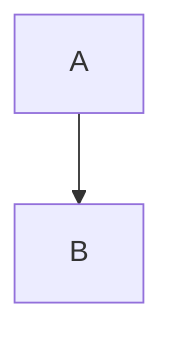
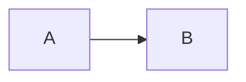
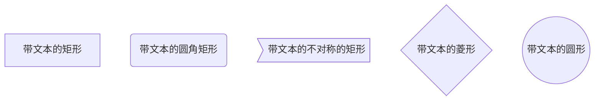
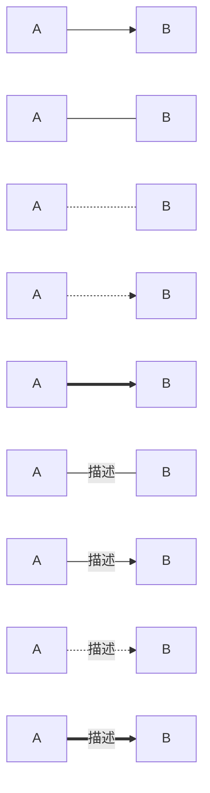
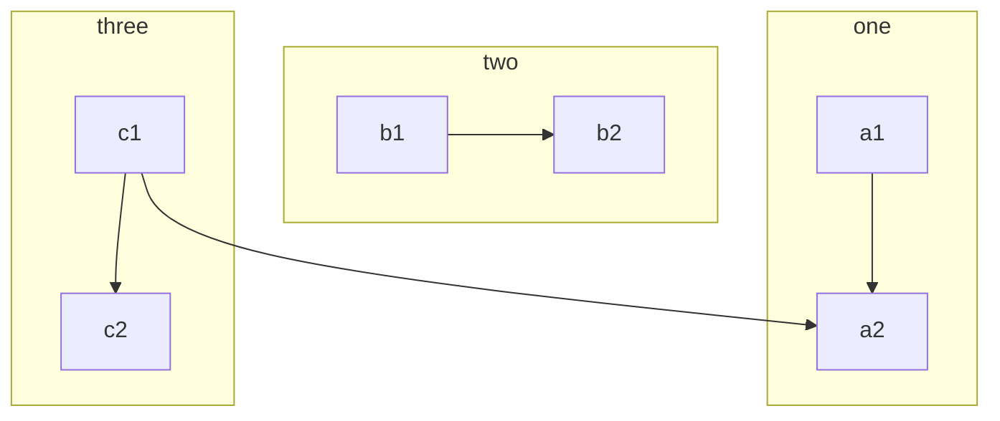
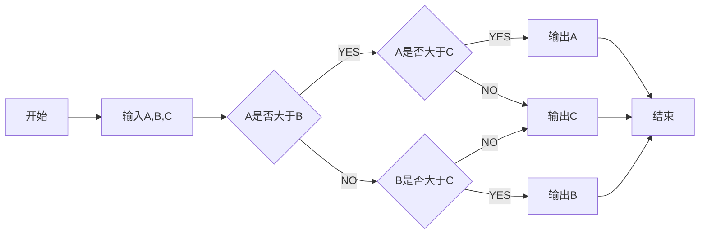
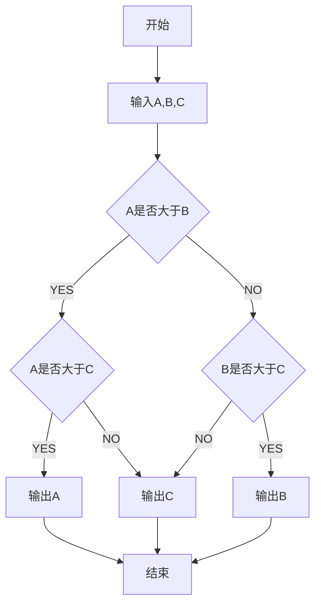
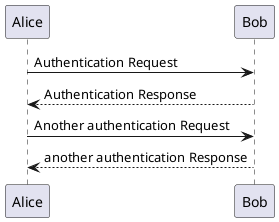

# 语法示例

## 常规markdown语法

略

参考[Markdown语法大全(超级版)](https://www.jianshu.com/p/ebe52d2d468f)

## docsify扩展配置

### 待办事项

- [x] 任务1
- [ ] 任务2
  - [ ] 待处理
  - [ ] 处理中
  - [x] 已完成

### 更多语法支持

#### html

````html
<!DOCTYPE html>
<html lang="en">
<head>
<meta charset="utf-8" />
<title>Prism</title>
</head>
<body>
<footer data-src="templates/footer.html" data-type="text/html"></footer>
</body>
</html>
````

#### javascript

````javascript
/**
 * Manage downloads
 */
(function() {
    var cache = {};
    var treeURL = 'https://api.github.com/repos/PrismJS/prism/git/trees/gh-pages?recursive=1';
    var treePromise = new Promise(function(resolve) {
        $u.xhr({
            url: treeURL,
            callback: function(xhr) {
                if (xhr.status < 400) {
                    resolve(JSON.parse(xhr.responseText).tree);
                }
            }
        });
    });
});
````

#### svg

````svg
<svg xmlns="http://www.w3.org/2000/svg" viewBox="0 0 200 170">
 <path fill="#fff" d="M55.37 131.5H48.4v9.13h6.97c1.67 0 2.92-.4 3.78-1.22.85
 -.8 1.28-1.92 1.28-3.33s-.43-2.54-1.28-3.35c-.86-.8-2.12-1.2-3.78-1.2m29.52
 6.4c.3-.53.47-1.2.47-2.04 0-1.35-.45-2.4-1.37-3.2-.92-.76-2.14-1.15-3.65
 -1.15H72.9v8.52h7.32c2.26 0 3.82-.7 4.67-2.1M100 0L0 170h200L100 0M60.86
 141.03c-1.3 1.22-3.1 1.84-5.33 1.84H48.4v7.55H46v-21.2h9.53c2.24 0 4.02.63
 5.34 1.87 1.3 1.23 1.96 2.88 1.96 4.95 0 2.1-.66 3.75-1.97 4.98m24.5 9.4l
 -5.1-8.14h-7.37v8.12h-2.4v-21.2h10.14c2.15 0 3.88.6 5.18 1.8 1.3 1.18 1.95
 2.8 1.95 4.84 0 2.64-1.1 4.44-3.3 5.4-.6.28-1.22.5-1.82.6l5.57 8.56h-2.85m
 13.43 0h-2.4v-21.2h2.4v21.2m23.56-1.32c-1.48 1.05-3.53 1.57-6.16 1.57-2.96 0
 -5.23-.6-6.78-1.85-1.4-1.1-2.18-2.7-2.37-4.74h2.5c.08 1.45.78 2.56 2.1 3.33
 1.16.67 2.68 1 4.58 1 3.97 0 5.95-1.25 5.95-3.74 0-.86-.35-1.53-1.07-2.02-.7
 -.5-1.6-.9-2.68-1.2-1.07-.33-2.24-.63-3.48-.9s-2.4-.65-3.5-1.08-1.97-1.02
 -2.68-1.73c-.7-.72-1.07-1.68-1.07-2.9 0-1.73.65-3.13 1.97-4.22 1.32-1.08
 3.32-1.62 6-1.62 2.67 0 4.75.6 6.23 1.85 1.34 1.1 2.05 2.5 2.14 4.2h-2.46c
 -.22-1.76-1.35-2.92-3.4-3.5-.72-.2-1.62-.3-2.7-.3s-1.98.1-2.72.35c-.74.25
 -1.3.55-1.7.9-.42.35-.7.74-.83 1.17s-.2.88-.2 1.36c0 .5.2.93.62 1.33s.96.75
 1.65 1.03c.68.28 1.46.52 2.33.73.88.2 1.77.43 2.67.65.9.22 1.8.48 2.68.77.87
 .3 1.65.65 2.33 1.1 1.53.96 2.28 2.27 2.28 3.94 0 2-.74 3.5-2.22 4.55m28.84
 1.32v-17.54l-7.84 10.08-7.97-10.08v17.54H133v-21.2h2.78l7.58 10.06 7.45
 -10.05h2.8v21.2h-2.4"/>
</svg>
````

#### json

````json
{
  "name": "prism",
  "main": [
      "prism.js",
      "themes/prism.css"
  ]
}
````

#### php

```php
<?php
/**
 * Created by PhpStorm.
 */
$result = array();
if(!empty($_POST)){
    $result['postparam'] = $_POST;
}else{
    $result['postdesc'] ="未接收到POST参数";
}
echo json_encode($result);
exit;
```

#### css

```css
@import url(https://fonts.googleapis.com/css?family=Questrial);
@font-face {
 src: url(https://lea.verou.me/logo.otf);
 font-family: 'LeaVerou';
}
/*
 Styles
 */
* {
 margin: 0;
 padding: 0;
}
```

### 流程图

#### 流程图方向

> TB 从上到下
>
> BT 从下到上
>
> RL 从右到左
>
> LR 从左到右
>
> TD 同TB
>

从上到下




从左到右




#### 基本图形

> id + [文字描述]矩形
>
> id + (文字描述)圆角矩形
>
> id + >文字描述]不对称的矩形
>
> id + {文字描述}菱形
>
> id + ((文字描述))圆形
>

基本图形




#### 节点之间的连接

> A --> B A带箭头指向B
>  
> A --- B A不带箭头指向B
>  
> A -.- B A用虚线指向B
>  
> A -.-> B A用带箭头的虚线指向B
>  
> A ==> B A用加粗的箭头指向B
>  
> A -- 描述 --- B A不带箭头指向B并在中间加上文字描述
>  
> A -- 描述 --> B A带箭头指向B并在中间加上文字描述
>  
> A -. 描述 .-> B A用带箭头的虚线指向B并在中间加上文字描述
>
> A == 描述 ==> B A用加粗的箭头指向B并在中间加上文字描述




#### 子流程图




#### demo

绘制一个流程图,找出 A、 B、 C 三个数中最大的一个数。





### uml图



### KaTeX

#### 行内公式

$\sqrt{3x-1}+(1+x)^2$

#### 公式块

$$
\begin{array}{c}
\nabla \times \vec{\mathbf{B}} -\, \frac1c\, \frac{\partial\vec{\mathbf{E}}}{\partial t} &
= \frac{4\pi}{c}\vec{\mathbf{j}}    \nabla \cdot \vec{\mathbf{E}} & = 4 \pi \rho \\
\nabla \times \vec{\mathbf{E}}\, +\, \frac1c\, \frac{\partial\vec{\mathbf{B}}}{\partial t} & = \vec{\mathbf{0}} \\
\nabla \cdot \vec{\mathbf{B}} & = 0
\end{array}
$$

#### 正常文本中\$和\`的处理

Anything between two \$ characters will be treated as TeX math. The opening \$ must
have a non-space character immediately to its right, while the closing \$ must
have a non-space character immediately to its left, and must not be followed
immediately by a digit. Thus, \$20,000 and \$30,000 won’t parse as math. If for some
reason you need to enclose text in literal $ characters, backslash-escape them and
they won’t be treated as math delimiters.

## Flexible Alerts

| Key | Allowed value |
| -|- |
| style | One of following values: callout, flat |
| label | Any text |
| icon | A valid Font Awesome icon, e.g. 'fas fa-comment' |
| className | A name of a CSS class which specifies the look and feel |
| labelVisibility | One of following values: visible (default), hidden |
| iconVisibility | One of following values: visible (default), hidden |

> [!NOTE]
> An alert of type 'note' using global style 'callout'.
> [!NOTE]
> An alert of type 'note' using alert specific style 'flat' which overrides global style 'callout'.
> [!TIP|label:My own heading|iconVisibility:hidden]
> An alert of type 'tip' using alert specific style 'flat' which overrides global style 'callout'.
> In addition, this alert uses an own heading and hides specific icon.
> [!tip]
> An alert of type 'note' using global style 'callout'.
> [!warning]
> An alert of type 'note' using global style 'callout'.
> [!danger]
> An alert of type 'note' using global style 'callout'.
